# The Day Spa

My source control repository is located on GitHub, and can be found here [here](https://github.com/russ-13/TerminalApp)

## Software Development Plan

### Description

The application will provide a database of existing clients for a Day Spa business. It will feature the ability to create new customers, view their customer details and store their number of loyalty points, with the ability to reset this counter or inform the staff member when the customer is eligible for a free session or other reward/discount. It will be used by Day Spa staff and have a password to protect unauthorized usage and feature a function for the staff member to check upcoming birthdays and display the customers phone number to send out advertising material and birthday deals. 

### What Will This Program Solve?

It solves a real world problem in a business that I own,  where loyalty cards are often destroyed. These points are tracks on paper cards and simple stamps can be destroyed in the wash or faked easily. Customer details have previously been recorded on paper and handwriting can be misinterpreted leading to lost customer details.

### Target Audience

The target audience will be the behind the counter staff of a day spa business working at the store on any particular day. It could be very simply modified for many types of businesses needing a customer database and loyalty point system.

### How will the Target Audience Use It?

A store worker will run the program after entering their password, and exit it at the end of their shift. They can  select from these options.

  1) Create Customer
  2) View Customer
  3) View All Customers
  4) View Birthdays
  5) Book Customer
  6) Delete Customer
  7) Exit

Upon selecting add new customer, they will be able to assign a new customer to the database and enter their contact information, and assign a beginning number of loyalty points depending on the type of service they are booking in at the time. 
When booking in a new customer, they will search for a return the existing customer, and be presented with how many loyalty points they have. The user can then reset their points and not charge the customer for the current booking, or add a number of points depending on the booking they are making. 
The customers details and loyalty points will then be saved for the next time they arrive. 

## List of features

1.	Add new customers details, phone number, name DOB and points accrued 

A feature where the user can create a new entry for a new customer. This will ask the user for input, Name, Phone, DOB and Loyalty Points and then pass these values into a hash, within an array. This will be selected from the TTY prompt menu, and use a method. When the method has run, it will return the user to the main menu.

2.	View individual customer details, and display ALL customers

Selecting this from the main menu will call a method to ask the user for input, then iterate through the array of hashes containing customers, and display the customer who matches the requested phone number.

There will be a second option to display ALL customers added.

3.	Delete old customer records

Selecting this from the menu will allow the user to enter a phone number, then we will iterate through the array of hashes and then delete that specific hash.

4.	Reset the points number when they are ‘cashed in’, and add them when a customer makes a booking

This feature will allow the user to select an existing customer, and then either add or subtract loyalty points to that key inside the array of hashes. It will then display the remaining points. 

5.	See which customers have a birthday today

A feature to search for a date and show customers who have a birthday on that date. 

This will iterate through the array of hashes, and display the customers who match up with the correct birthday, and display a string along the lines of "*Customer* has a birthday today! Call them on ********"

7.  Password Protection so only staff can use the program

Password protection will be added via a pre-shared password that only staff will know, and a while loop will be utilized that while the password variable is false, the loop will continue, and only when the user input is equal to the password will the loop end and the program will continue.

8.  Import and Export a file to store customers (This feature was too complex and was abandoned!)

If time permits, JSON or YAML will be looked into to provide a database of customers. This feature has not been developed yet but I will continue to develop this in the future, as I intent on using this app or another version of it in my business.

These features are described in my Trello board and in the included screenshots below. 

## User Interaction

The program is designed to be very intuitive, and not require any user manual to operate, other than being informed of a password by their line manager. This

The password for the program is "1234"

Simple command titles will inform the user what the commands will do, and if blank responses are entered, the program will prompt the user that an error has occurred, and they need to input something. 

For creating a new customer, they user or staff member will be prompted to enter a Name, Mobile Number, DOB, and Loyalty points, then be retuned to the main menu. This will create a card that can later be viewed, deleted or booked in at a later date, and searchable via Mobile Number or Date of Birth.

Viewing customers information will be shown when entering their mobile number. Entering a date of birth will show which customers have a birthday on that date. Entering

Booking customers will be done via selecting that menu option, then bringing up their details with the mobile number, then the user will enter the desired amount of loyalty points to add or subtract from a handy menu that will show how many loyalty points should be added or redeemed. 

## Control Flow

Please see the following diagram

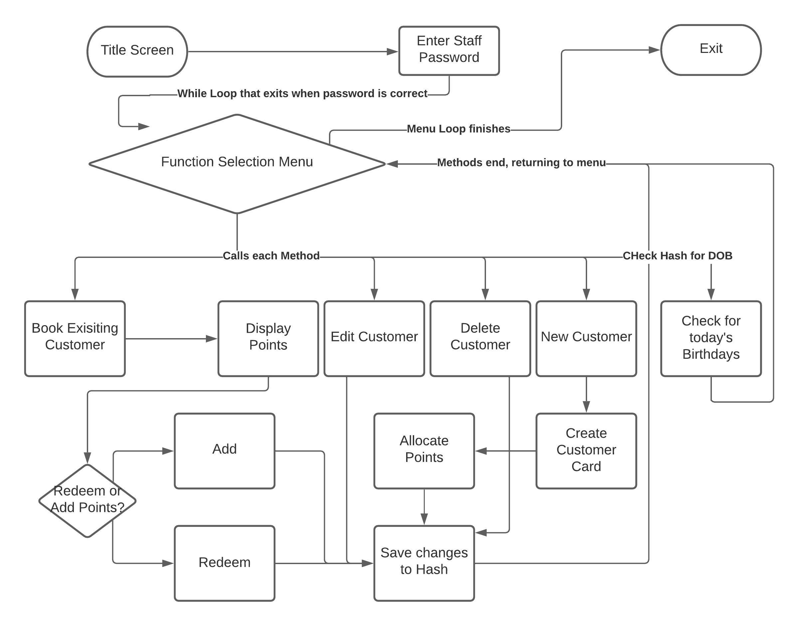


## Implementation Plan

I used Trello software for my implementation plan, a link to my Trello board can be found [here](https://trello.com/b/mrbu26rR/loyalty-app)

Below I have included screenshots of my day to day progress of the Trello board, and each features card.

Day 1

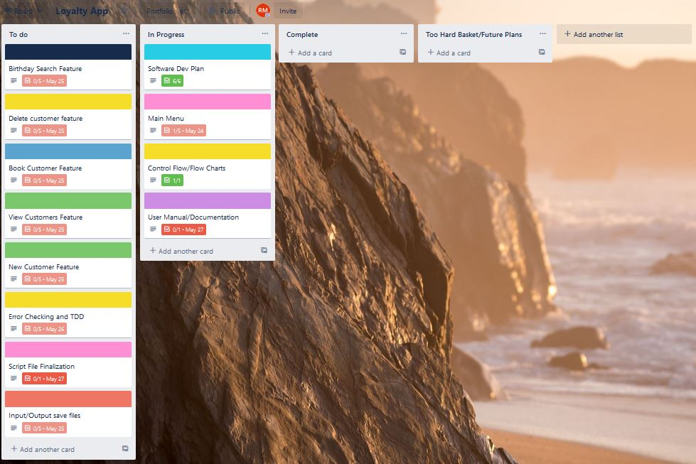

Day 2

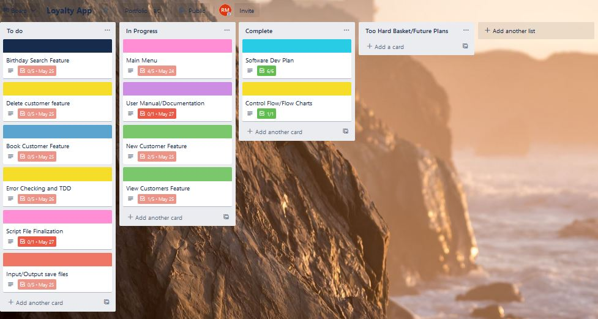

Day 3

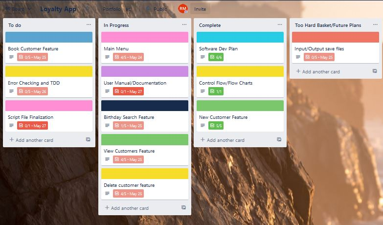

Day 4

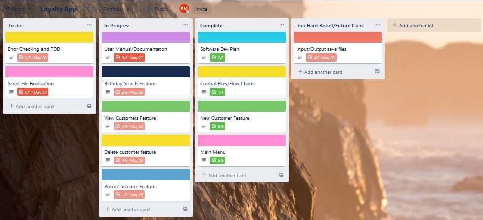

Day 5

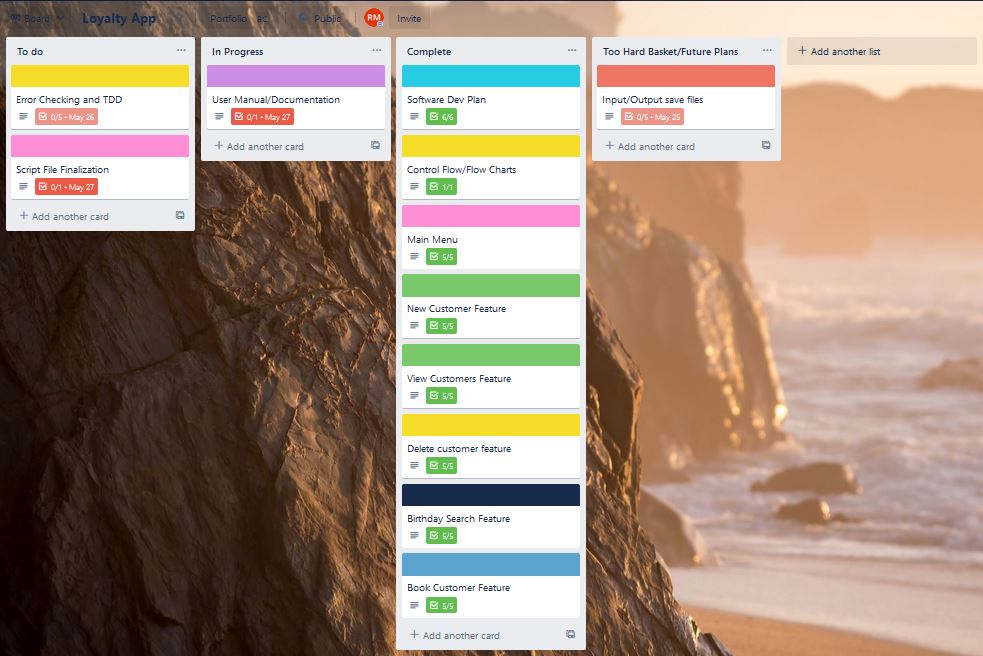

Day 6

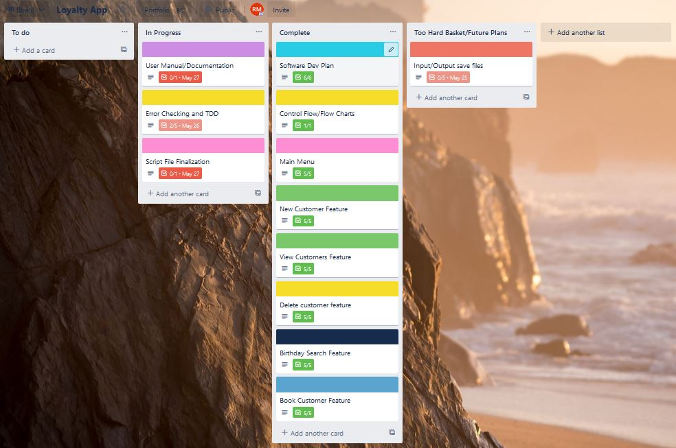

Day 7

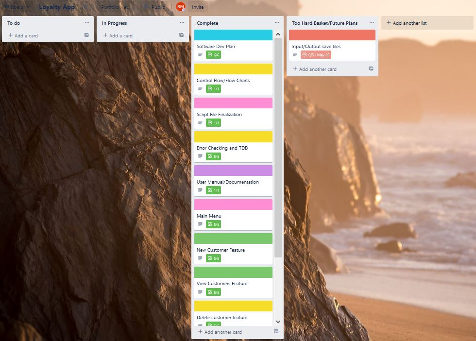

Below are my feature cards.

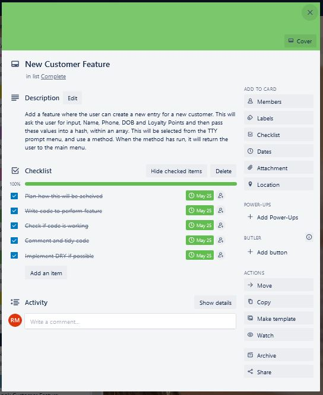

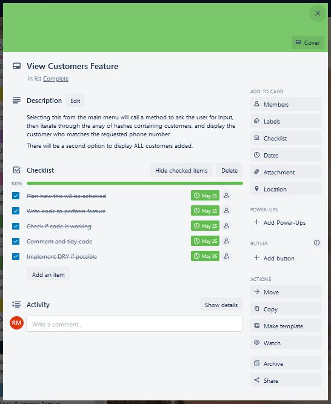

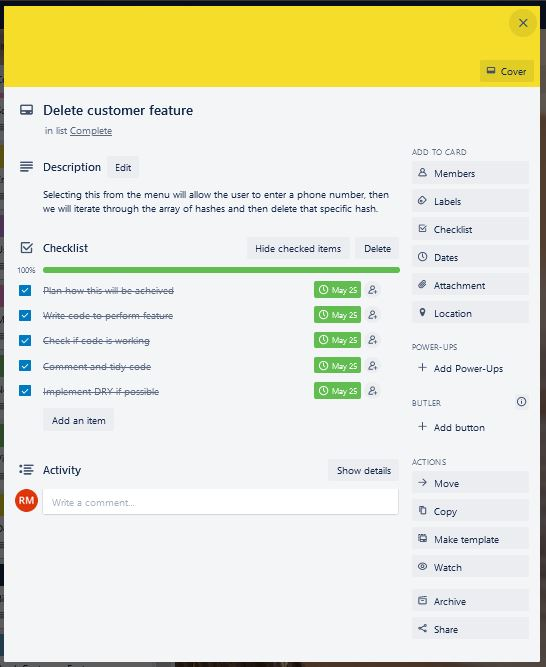

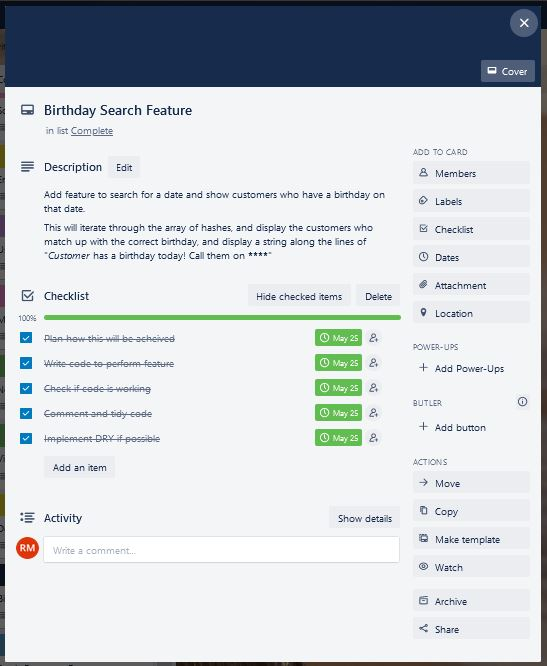

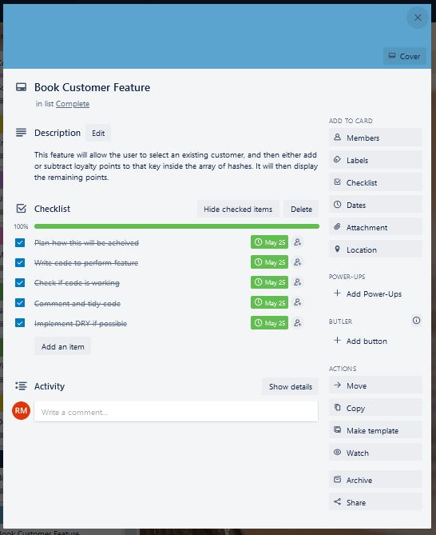

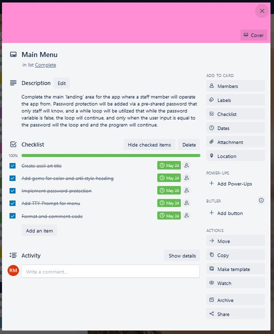

## Help Documentation

This will allow the staff member to login, please inform them of the password before use, and see your system administrator for instructions on how to change the password should an employee leave.

The staff password for the app is "1234"


### Steps to install

This application will need Ruby to be installed. Please follow the link and instructions [here](https://www.ruby-lang.org/en/documentation/installation/) to install Ruby.

The following commands will then need to be run from your terminal app, preferably Ubuntu or Git. Git can be found for all operating systems [here](https://git-scm.com/downloads)

Then run these commands:

```git clone git@github.com:russ-13/TerminalApp.git```

This will copy the repo to your local system. 

You can now install the gem bundler, which allows the gems or plugins to run. Run these commands:

```gem install bundler```

```bundle install```

Alternatively you can install the gems individually by running these commands:

```gem install tty-prompt```

```gem install colorize```

```gem install rainbow```

```gem install artii```

You can now run the app with this command:

```./run_app.sh```

The staff password for the app is "1234"

### Dependencies

This app uses four Ruby Gems that will be installed by the bundler.

1. gem "artii", "~> 2.1"
2. gem "colorize", "~> 0.8.1"
3. gem "rainbow", "~> 3.0"
4. gem "tty-prompt", "~> 0.23.1"

### System Requirements

There are no hardware requirements for this app to run. Only software requirements listed above in the Steps To Install section of this document.